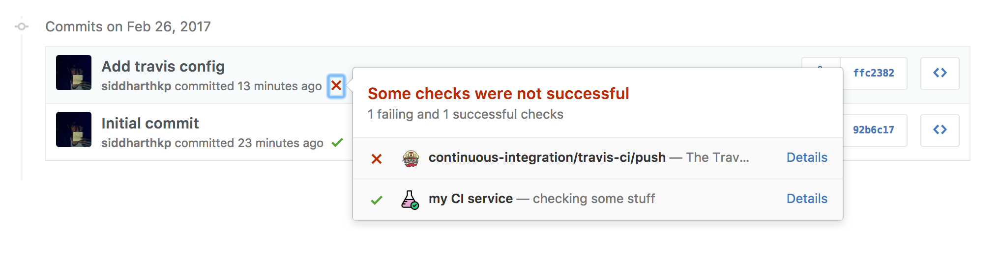
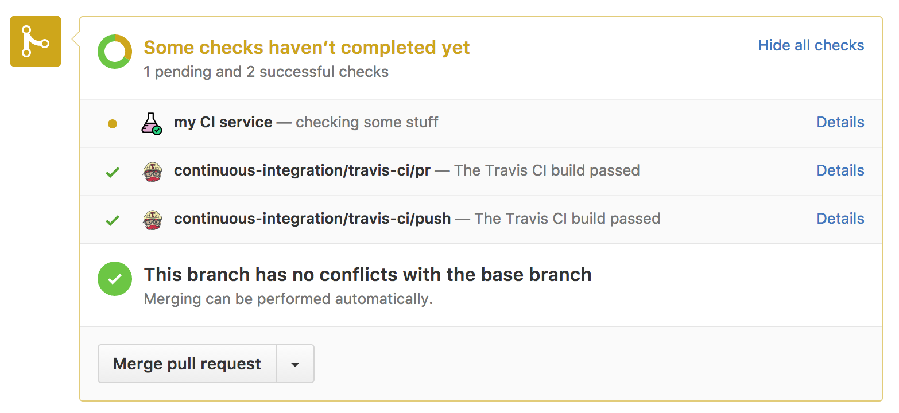

<p align="center">
  
  <br><br>
  <b>Github builds/checks for CI</b>
  <br><br>
  
</p>
<p>
  
  <br>
  
</p>

&nbsp;

[](https://lima.codeclimate.com/github/siddharthkp/github-build)
[](https://snyk.io/test/github/siddharthkp/github-build)

&nbsp;

#### Install

```
npm install github-build --save
```

#### Usage

```js
const Build = require('github-build')

const data = {
  repo: 'siddharthkp/github-build', // (author/repo)
  sha: '6954e71d46be1ae9b0529aae6e00b64d7a1023d4', // (commit sha)
  token: 'secret', // (github oauth token: https://developer.github.com/v3/oauth)
  label: 'my CI service',
  description: 'checking some stuff',
  url: 'http://my-ci-service.com/builds/1', // details url
}

const build = new Build(data) // get a new build

build.start() // add a status with state pending (returns a promise)

build.pass() // mark build as passed (returns a promise)

build.fail() // mark build as failed (returns a promise)

build.error() // use when build errors out (returns a promise)

```

&nbsp;

If you like it then [you should put a ⭐️ on it](https://www.youtube.com/watch?v=4m1EFMoRFvY)

&nbsp;

#### License

MIT © siddharthkp
